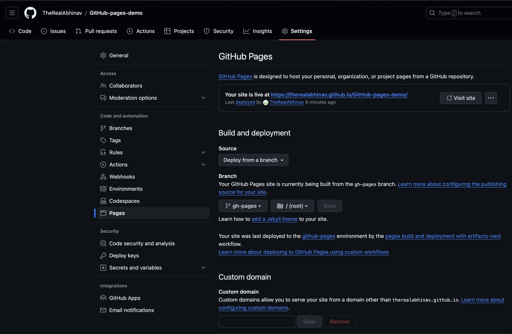

# GitHub-pages-demo
A simple demo for github pages

## The Master branch
- Master branch does not contain any code for the website
- Master branch may contain some other codes related to the webpage

## The gh-pages
- Contains the code to host the website
- Source of the website, make the changes here to modify the website
- We can name the branch that is holding the index.html file with any name other than gh-pages
- github pages can only hold static pages (HTML/CSS/JS)

## IMP
- Repo needs to be public to use github pages
- Once html code has been deployed, navigate to repo -> settings -> pages

